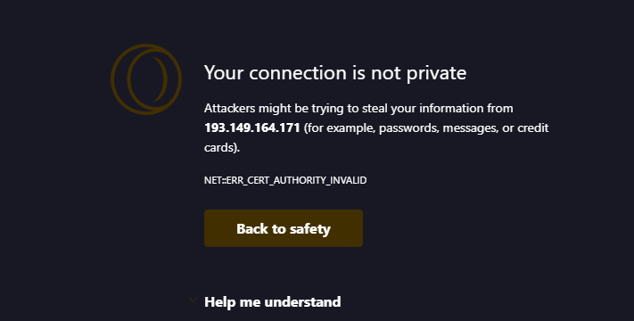
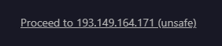

# Instructions

- unzip the alltalk_tts folder I sent you.
- Go into ``` alltalk_tts/finetune/XTTS_Chilean_Voices/ ``` folder
- replace the place holder metadata.csv files with your own
- put your segmented audio wav files into the wavs folder.r
- in this folder is a folder called ```"put-voice-samples-in-here" ```. Inside this folder you put the raw complete full audio files. NOT THE SEGMENTED FILES.

once this is done zip it all back up. make sure you dont change any of the other folder names. 

- On your machine hold windows key and tap r
- type cmd hit enter
- copy and paste this and hit enter: ``` wget -qO- cli.runpod.net | sudo bash ```
- in the terminal where the alltalk_tts.zip folder that you made is type: ``` runpodtctl send alltalk_tts.zip ```
- let that do its thing and when its done you will get a code. Do not close the terminal. Just keep it on standby for now


# Go to Vast.ai

- Select templates on the left
- Search for ``` "cuda:12.0.1-devel-ubuntu20.04" ```
- push edit
- Select "Run a jupyter-python notebook (easiest). A browser based GUI with python editor, bash terminal and more. SSH as well." AND "Jupyter direct HTTPS - much faster, but requires first loading our TLS certificate in your browser (one-time)." 
- Scroll down to recommended disk space.
- Drag the slider to around 120gb
- push the select and save button at the bottm
- Then on the top where it says planet earth select an area close to you
- pick out the cheapest RTX 4090 or if you want to train using more compute then you can use an H100 or A100. The other GPU's are slower than a 4090. Note: You cannot train coqui models on multi GPU. It must be a single GPU.
- click rent then go to the instances tab.

- Give it a second and youll the cost per hour for the gpu. Right above that a little button will appear when the instance is ready. 
- 
<br>

- When you click that button you will get a screen like this. Click Help me understand. (Depending on your browser the messagfe may be different)

- 

- Click the "proceed link it shows you" and youll get a screen like this.


# Jupyter Notebook
- Go to file then new and terminal
- in the terminal paste this then hit enter: git clone -b alltalkbeta https://github.com/erew123/alltalk_tts
- type cd alltalk_tts
- type: ``` bash ./atsetup.sh ```
- push 2 hit enter
- push 1 hit enter


- while that is going go up to file the new then terminal again
- paste this ``` wget -qO- cli.runpod.net | sudo bash ```
- Now go copy that code from earlier when you used runpodctl send on the alltalk_tts.zip file. Paste it into the terminal and hit enter.
- While this is going go up to file new terminal
- type: ``` apt-get install unzip ``` 
  

  in the graphical interface jupyter notebook you can navigate into the alltalk_tts folder and open the finetune.py file
  - Scroll down to the bottom of that file and find ``` server_name="127.0.0.1" ``` change it to ``` server_name="0.0.0.0" ```
  - change ``` share=False,``` to ``` share=True,```
  - Go up to file and click save
  - 
  ### Now we wait for the upload of the data/Install of the repo
 
  - when the upload is done. IN THE SAME TERMINAL TYPE: ``` unzip alltalk_tts.zip ``` 
  - This will unzip the alltalk_tts.zip file and because you setup the folders before hand you wont have to touch anything else.
  - Now go back to the terminal where you installed the alltalk_tts repo
  - type : ``` bash start_finetune.sh ```
  - this will start the finetune script

## Skip transcription and open the finetuning tab
- in the metadata_train.csv field put ``` /root/alltalk_tts/finetune/XTTS_Chilean_Voices/metadata_train.csv ```
- in the metadata_eval.csv field put ``` /root/alltalk_tts/finetune/XTTS_Chilean_Voices/metadata_eval.csv ```

- if youre using a 4090 
- change the batch size to 3
- change gradient accumulation to 9
- and set the epochs to 50
- PUSH THE START BUTTON
  
